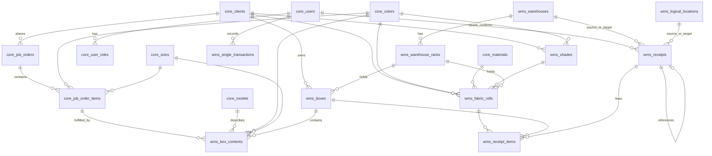

# Database schema overview

This document describes the PostgreSQL schema as represented by the SQLAlchemy models in [`backend/models.py`](../backend/models.py). Manual DDL and migration notes live in [`schema-changes.md`](schema-changes.md). The application uses two PostgreSQL schemas: **`core`** (master data, users, job orders, materials) and **`wms`** (warehouse operations, fabric rolls, shades, inventory movement).

---

## Architecture at a glance

| Schema | Purpose |
|--------|---------|
| `core` | Clients, materials, product dimensions (model/color/size), job orders and line items, authentication (`users`, `user_roles`). |
| `wms` | Physical warehouse structure, racks, shades, fabric rolls, boxes and contents, receipts, logical locations, ad-hoc single transactions. |

PostgreSQL `ENUM` types used by `wms` tables are declared with `schema='wms'` and `create_type=False` in the ORM, meaning types are expected to exist in the database already (not auto-created on metadata create).

---

## PostgreSQL ENUM types (`wms`)

| Type name | Values |
|-----------|--------|
| `wms.warehouse_type` | `Fabric`, `RMG`, `Accessory` |
| `wms.receipt_type` | `inbound`, `dyehouse`, `internal`, `shipping` |
| `wms.receipt_status` | `issued`, `confirmed`, `cancelled` |
| `wms.transaction_type` | `IN`, `OUT` |

Python mirrors these in `WarehouseType`, `ReceiptType`, `ReceiptStatus`, and `TransactionType` in the same module.

---

## Entity relationship (high level)



---

## Schema: `core`

The **production** database (`CPC_INTEGRATED_SYSTEM`) uses the column names below for primary keys (**`client_id`**, **`color_id`**, **`material_id`**, etc.—not `id`). The SQLAlchemy models in [`backend/models.py`](../backend/models.py) map these to `id` / `name` / `value` via **`synonym`** where needed so Pydantic schemas stay stable. **Do not ALTER core tables from this application**; WMS only adds foreign keys *to* these columns.

### `core.clients`

| Column | Type | Constraints / notes |
|--------|------|---------------------|
| `client_id` | `INTEGER` | Primary key |
| `client_name` | `VARCHAR` | `NOT NULL` |

**Relationships:** One-to-many to `wms.boxes`, `core.job_orders`, `wms.shades`, and `wms.fabric_rolls`.

---

### `core.models`

Product/style model names (not SQLAlchemy `Model` metadata).

| Column | Type | Constraints / notes |
|--------|------|---------------------|
| `model_id` | `INTEGER` | Primary key |
| `model_name` | `VARCHAR` | `NOT NULL` |

**Relationships:** One-to-many to `wms.box_contents`, `core.job_orders`.

---

### `core.colors`

| Column | Type | Constraints / notes |
|--------|------|---------------------|
| `color_id` | `INTEGER` | Primary key |
| `color_name` | `VARCHAR` | `NOT NULL` |

**Relationships:** Referenced by `core.job_order_items`, `wms.box_contents`, `wms.shades`, and `wms.fabric_rolls`.

---

### `core.materials`

| Column | Type | Constraints / notes |
|--------|------|---------------------|
| `material_id` | `INTEGER` | Primary key |
| `material_name` | `VARCHAR` | `NOT NULL` |

**Relationships:** One-to-many to `wms.fabric_rolls` (`material_id`).

---

### `core.sizes`

| Column | Type | Constraints / notes |
|--------|------|---------------------|
| `size_id` | `INTEGER` | Primary key |
| `size_value` | `VARCHAR` | `NOT NULL` |

**Relationships:** Referenced by `core.job_order_items` and `wms.box_contents`.

---

### `core.job_orders`

| Column | Type | Constraints / notes |
|--------|------|---------------------|
| `job_order_id` | `INTEGER` | Primary key |
| `model_id` | `INTEGER` | Nullable, FK → `core.models.model_id` |
| `job_order_number` | `VARCHAR` | `NOT NULL` |
| `client_id` | `INTEGER` | `NOT NULL`, FK → `core.clients.client_id` |
| `image_url` | `VARCHAR` | Nullable |
| `notes` | `TEXT` | Nullable |
| `print_config` | `JSONB` | Nullable |
| `date_created` | `TIMESTAMP` | Nullable |
| `priority` | `INTEGER` | Nullable |

**Relationships:** `client`, `model`; one-to-many `job_order_items`.

---

### `core.job_order_items`

Line-level demand: color, size, quantity (and optional weight).

| Column | Type | Constraints / notes |
|--------|------|---------------------|
| `item_id` | `INTEGER` | Primary key |
| `job_order_id` | `INTEGER` | `NOT NULL`, FK → `core.job_orders.job_order_id` |
| `color_id` | `INTEGER` | `NOT NULL`, FK → `core.colors.color_id` |
| `size_id` | `INTEGER` | `NOT NULL`, FK → `core.sizes.size_id` |
| `quantity` | `INTEGER` | `NOT NULL` |
| `weight` | `NUMERIC` | Nullable |
| `notes` | `TEXT` | Nullable |

**Relationships:** `job_order`, `color`, `size`; optional link from `wms.box_contents` (`job_order_item_id` → `item_id`).

---

### `core.users`

| Column | Type | Constraints / notes |
|--------|------|---------------------|
| `id` | `INTEGER` | Primary key, indexed |
| `username` | `VARCHAR(50)` | `NOT NULL`, `UNIQUE` |
| `password_hash` | `VARCHAR(255)` | `NOT NULL` |

**Relationships:** `user_roles`; referenced by `wms.receipts` (`issued_by`, `confirmed_by`) and `wms.single_transactions` (`user_id`).

---

### `core.user_roles`

| Column | Type | Constraints / notes |
|--------|------|---------------------|
| `id` | `INTEGER` | Primary key, indexed |
| `user_id` | `INTEGER` | `NOT NULL`, FK → `core.users.id` |
| `system_id` | `INTEGER` | `NOT NULL`, FK → `core.systems.id` |
| `role` | `VARCHAR(50)` | `NOT NULL` |

**Note:** The ORM no longer defines a `System` model (see comments in `models.py`), but `system_id` still declares a foreign key to `core.systems.id`. The database is expected to retain a `core.systems` table (or equivalent) for referential integrity, or the FK reflects legacy DDL.

---

## Schema: `wms`

### `wms.warehouses`

| Column | Type | Constraints / notes |
|--------|------|---------------------|
| `id` | `INTEGER` | Primary key, indexed |
| `name` | `VARCHAR(100)` | `NOT NULL`, `UNIQUE` |
| `type` | `wms.warehouse_type` | `NOT NULL` |

**Relationships:** One-to-many `warehouse_racks`.

---

### `wms.warehouse_racks`

| Column | Type | Constraints / notes |
|--------|------|---------------------|
| `id` | `INTEGER` | Primary key, indexed |
| `warehouse_id` | `INTEGER` | `NOT NULL`, FK → `wms.warehouses.id` |
| `rack_code` | `VARCHAR(50)` | `NOT NULL` |

**Relationships:** `warehouse`; one-to-many `boxes` and optional receipt references (see `wms.receipts`).

---

### `wms.shades`

Canonical shade numbers per **client + color** (`shade_number` is sequential within each pair; enforced in application or trigger).

| Column | Type | Constraints / notes |
|--------|------|---------------------|
| `id` | `INTEGER` | Primary key, indexed |
| `client_id` | `INTEGER` | `NOT NULL`, FK → `core.clients.id` |
| `color_id` | `INTEGER` | `NOT NULL`, FK → `core.colors.id` |
| `shade_number` | `INTEGER` | `NOT NULL`; `UNIQUE (client_id, color_id, shade_number)`; `CHECK (shade_number > 0)` |

**Relationships:** `client`, `color`; one-to-many `wms.fabric_rolls` (`shade_id`).

---

### `wms.fabric_rolls`

Fabric inventory at roll granularity: FKs to `core` clients/colors/materials, optional `wms.shades` and rack.

Reference DDL:

```sql
CREATE TABLE wms.fabric_rolls (
    id BIGINT GENERATED BY DEFAULT AS IDENTITY PRIMARY KEY,
    roll_id VARCHAR(50) NOT NULL UNIQUE,
    barcode VARCHAR(100) UNIQUE,
    client_id INTEGER NOT NULL REFERENCES core.clients(id),
    color_id INTEGER REFERENCES core.colors(id),
    material_id INTEGER NOT NULL REFERENCES core.materials(id),
    lot_number VARCHAR(50),
    gsm NUMERIC(6,2),
    fabric_width NUMERIC(6,2),
    weight_kg NUMERIC(8,3) NOT NULL,
    meterage NUMERIC(8,2),
    status VARCHAR(3) NOT NULL DEFAULT 'in',
    CONSTRAINT ck_fabric_rolls_status CHECK (status IN ('in', 'out')),
    rack_id INTEGER REFERENCES wms.warehouse_racks(id) ON UPDATE CASCADE ON DELETE SET NULL,
    defect_points INTEGER DEFAULT 0,
    quality_grade VARCHAR(20),
    shade_id INTEGER REFERENCES wms.shades(id) ON UPDATE CASCADE ON DELETE SET NULL,
    received_date TIMESTAMP,
    issued_date TIMESTAMP,
    supplier VARCHAR(100),
    remarks TEXT
);
```

| Column | Type | Constraints / notes |
|--------|------|---------------------|
| `id` | `BIGINT` | Primary key, identity |
| `roll_id` | `VARCHAR(50)` | `NOT NULL`, `UNIQUE` |
| `barcode` | `VARCHAR(100)` | `UNIQUE`, nullable |
| `client_id` | `INTEGER` | `NOT NULL`, FK → `core.clients.id` |
| `color_id` | `INTEGER` | Nullable, FK → `core.colors.id` |
| `material_id` | `INTEGER` | `NOT NULL`, FK → `core.materials.id` |
| `lot_number` | `VARCHAR(50)` | Nullable |
| `gsm` | `NUMERIC(6,2)` | Nullable |
| `fabric_width` | `NUMERIC(6,2)` | Nullable |
| `weight_kg` | `NUMERIC(8,3)` | `NOT NULL` |
| `meterage` | `NUMERIC(8,2)` | Nullable |
| `status` | `VARCHAR(3)` | `NOT NULL`, default `'in'`; check `in`/`out` |
| `rack_id` | `INTEGER` | Nullable, FK → `wms.warehouse_racks.id` |
| `defect_points` | `INTEGER` | Default `0` |
| `quality_grade` | `VARCHAR(20)` | Nullable |
| `shade_id` | `INTEGER` | Nullable, FK → `wms.shades.id` |
| `received_date` | `TIMESTAMP` | Nullable |
| `issued_date` | `TIMESTAMP` | Nullable |
| `supplier` | `VARCHAR(100)` | Nullable |
| `remarks` | `TEXT` | Nullable |

**Relationships:** `client`, `color`, `material`, optional `shade`, optional `rack`; referenced by `wms.receipt_items` (`roll_id`).

---

### `wms.boxes`

Physical carton/box tracked by barcode, optionally placed on a rack.

| Column | Type | Constraints / notes |
|--------|------|---------------------|
| `id` | `INTEGER` | Primary key, indexed |
| `rack_id` | `INTEGER` | Nullable, FK → `wms.warehouse_racks.id` (optional location) |
| `barcode` | `VARCHAR(100)` | `NOT NULL`, `UNIQUE` |
| `client_id` | `INTEGER` | `NOT NULL`, FK → `core.clients.id` |
| `weight` | `NUMERIC(10,2)` | Nullable (kg) |
| `received` | `BOOLEAN` | `NOT NULL`, default `false` |
| `carton_number` | `INTEGER` | Nullable |
| `shipment_id` | `INTEGER` | Nullable (no FK in model) |

**Relationships:** `rack`, `client`, one-to-many `box_contents`.

---

### `wms.box_contents`

Contents of a box: optional tie to a job order line and optional model/color/size breakdown.

| Column | Type | Constraints / notes |
|--------|------|---------------------|
| `id` | `INTEGER` | Primary key, indexed |
| `box_id` | `INTEGER` | `NOT NULL`, FK → `wms.boxes.id` |
| `job_order_item_id` | `INTEGER` | Nullable, FK → `core.job_order_items.id` |
| `model_id` | `INTEGER` | Nullable, FK → `core.models.id` |
| `color_id` | `INTEGER` | Nullable, FK → `core.colors.id` |
| `size_id` | `INTEGER` | Nullable, FK → `core.sizes.id` |
| `piece_count` | `INTEGER` | `NOT NULL` |
| `weight` | `NUMERIC(10,2)` | Nullable |

---

### `wms.receipts`

Movement/receipt document: type, optional **source** and **target** endpoints (each is **either** a warehouse **or** a logical location—never both at once), status, closure, optional link to another receipt, audit users and timestamps.

| Column | Type | Constraints / notes |
|--------|------|---------------------|
| `id` | `INTEGER` | Primary key, indexed |
| `receipt_type` | `wms.receipt_type` | `NOT NULL` |
| `source_warehouse_id` | `INTEGER` | Nullable, FK → `wms.warehouses.id` |
| `source_logical_location_id` | `INTEGER` | Nullable, FK → `wms.logical_locations.id` |
| `target_warehouse_id` | `INTEGER` | Nullable, FK → `wms.warehouses.id` |
| `target_logical_location_id` | `INTEGER` | Nullable, FK → `wms.logical_locations.id` |
| `status` | `wms.receipt_status` | `NOT NULL`, default `issued` |
| `closed` | `BOOLEAN` | `NOT NULL`, default `false` |
| `reference_receipt_id` | `INTEGER` | Nullable, self-FK → `wms.receipts.id` |
| `issued_by` | `INTEGER` | Nullable, FK → `core.users.id` |
| `confirmed_by` | `INTEGER` | Nullable, FK → `core.users.id` |
| `issued_at` | `TIMESTAMP` | Default `current_timestamp` |
| `confirmed_at` | `TIMESTAMP` | Nullable |

**Check constraints:** At most one of (`source_warehouse_id`, `source_logical_location_id`) non-null; same for target pair.

**Relationships:** `issuer`, `confirmer`, `items`, self `reference_receipt`; optional `source_warehouse`, `source_logical_location`, `target_warehouse`, `target_logical_location`.

---

### `wms.receipt_items`

| Column | Type | Constraints / notes |
|--------|------|---------------------|
| `id` | `INTEGER` | Primary key, indexed |
| `receipt_id` | `INTEGER` | `NOT NULL`, FK → `wms.receipts.id` |
| `roll_id` | `BIGINT` | Nullable, FK → `wms.fabric_rolls.id` |
| `box_id` | `INTEGER` | Nullable, FK → `wms.boxes.id` |

**Relationships:** `receipt`, optional `roll`, optional `box`.

---

### `wms.logical_locations`

Named parties/sites (contacts) for logistics—not the same as warehouse racks. Referenced by `wms.receipts` (`source_logical_location_id`, `target_logical_location_id`).

| Column | Type | Constraints / notes |
|--------|------|---------------------|
| `id` | `INTEGER` | Primary key, indexed |
| `name` | `VARCHAR(100)` | `NOT NULL`, `UNIQUE` |
| `contact_name` | `VARCHAR(100)` | Nullable |
| `contact_number` | `VARCHAR(20)` | Nullable |

---

### `wms.single_transactions`

Ad-hoc in/out transactions with receiver, purpose, and piece count.

| Column | Type | Constraints / notes |
|--------|------|---------------------|
| `id` | `INTEGER` | Primary key, indexed |
| `user_id` | `INTEGER` | Nullable, FK → `core.users.id` |
| `receiver_name` | `VARCHAR(255)` | `NOT NULL` |
| `purpose` | `VARCHAR(255)` | `NOT NULL` |
| `piece_count` | `INTEGER` | `NOT NULL` |
| `transaction_type` | `wms.transaction_type` | `NOT NULL` |
| `reference_id` | `INTEGER` | Nullable (no FK—generic reference) |
| `created_at` | `TIMESTAMP` | Default `current_timestamp` |

---

## Cross-schema dependencies

- **`core` → `wms`:** `wms.boxes.client_id` → `core.clients`; `wms.box_contents` → `core.job_order_items`, `core.models`, `core.colors`, `core.sizes`; `wms.shades` / `wms.fabric_rolls` → `core.clients`, `core.colors`; `wms.fabric_rolls.material_id` → `core.materials`.
- **`wms` → `core`:** `wms.receipts` and `wms.single_transactions` reference `core.users`.
- **`wms` (internal):** `wms.fabric_rolls.rack_id` → `wms.warehouse_racks.id`; `wms.fabric_rolls.shade_id` → `wms.shades.id`; `wms.receipt_items` → `wms.fabric_rolls`, `wms.boxes`; receipt source/target → `wms.warehouses` or `wms.logical_locations`.

---

## Implementation notes

1. **Single source of truth:** Table and column definitions live in `backend/models.py`. There is no Alembic migration tree in this repository; apply [`docs/schema-changes.md`](schema-changes.md) for existing databases. Production should also retain manual DDL for enums and `core.systems` (see `core.user_roles`).
2. **Loose integers:** `boxes.shipment_id` and `single_transactions.reference_id` have no foreign keys—interpretation is by convention until parent tables exist.
3. **Enums:** WMS enums are PostgreSQL-native types; keep Python enums and DB values in sync when evolving the schema.

---

*Generated from the `wms-cpc` codebase; update this file when `backend/models.py` changes.*
